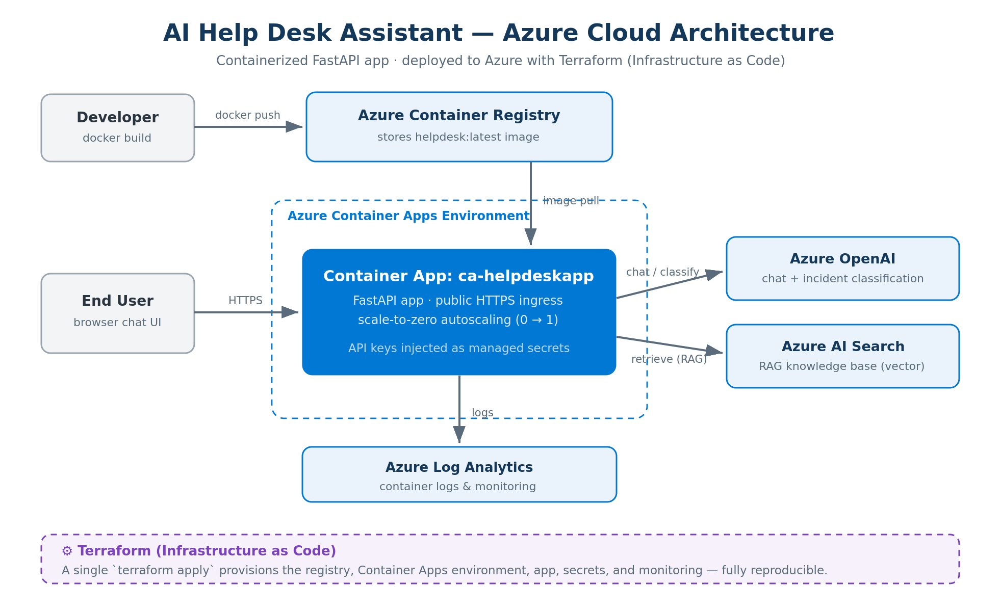

# AI Help Desk Assistant

An end-to-end, AI-powered IT support assistant built on the Microsoft / Azure stack. It handles multi-turn troubleshooting, automatically classifies incidents by category and priority, and answers questions using retrieval-augmented generation (RAG) over a knowledge base — then optionally files a ServiceNow ticket. The app is containerized with Docker and deployed to **Azure Container Apps entirely through Terraform (Infrastructure as Code)**.


**Live demo:** https://ca-helpdeskapp.wittybay-4e8fa55c.eastus.azurecontainerapps.io

> The app scales to zero when idle, so the **first request takes ~10–20 seconds** while the container wakes up. After that it responds quickly.

---

## Architecture



A request flows from the browser over HTTPS into a **Container App** running the FastAPI service. The app calls **Azure OpenAI** for conversational troubleshooting and incident classification, and **Azure AI Search** to retrieve grounded answers from the knowledge base (RAG). The container image is built locally with Docker, pushed to **Azure Container Registry (ACR)**, and pulled by the Container App at deploy time. API keys are supplied as **managed Container App secrets**, and container logs flow to **Azure Log Analytics**. Every Azure resource — registry, Container Apps environment, the app, its secrets, and monitoring — is defined in **Terraform** and created with a single `terraform apply`.

---

## What it does

- **Multi-turn troubleshooting** — holds context across a conversation using Azure OpenAI, asking clarifying questions instead of one-shot replies.
- **Incident classification** — infers a category and priority from intent (for example, flagging an account-compromise report as *security / critical*).
- **Retrieval-augmented answers (RAG)** — uses Azure AI Search vector embeddings to surface relevant knowledge-base articles even without exact keyword matches.
- **ServiceNow ticketing** *(optional)* — creates incidents through the ServiceNow REST Table API, mapping the AI-derived category and priority to ITSM fields.
- **Microsoft Entra ID sign-in** *(optional)* — OAuth 2.0 device-code flow via MSAL with a Microsoft Graph profile lookup and silent token caching.
- **Graceful degradation** — each external dependency fails safely, so the app stays usable even when an integration isn't configured.

---

## Tech stack

| Layer | Technologies |
|---|---|
| Application | Python, FastAPI, Uvicorn, browser chat UI |
| AI | Azure OpenAI (chat + classification), Azure AI Search (RAG / vector search) |
| Identity | Microsoft Entra ID, MSAL, Microsoft Graph (OAuth 2.0 device-code flow) |
| ITSM | ServiceNow REST Table API |
| Container | Docker |
| Infrastructure as Code | Terraform (azurerm provider) |
| Hosting | Azure Container Apps, Azure Container Registry, Azure Log Analytics |

---

## Infrastructure as Code

The entire cloud footprint lives in [`terraform/`](terraform/) and is reproducible from scratch. Terraform provisions:

- an **Azure Container Registry** (Basic) to hold the image,
- a **Log Analytics workspace** for container logs,
- a **Container Apps environment**, and
- the **Container App** itself — public HTTPS ingress on port 8000, scale-to-zero (`min_replicas = 0`), the image pulled from ACR, and API keys wired in as Container App secrets.

### Deploy it yourself

Prerequisites: Azure CLI, Terraform, and Docker installed; `az login` completed.

```bash
# 1. Provision the foundation (registry, environment, log analytics)
cd terraform
terraform init
terraform apply -auto-approve   # outputs the ACR name/login server

# 2. Build the image and push it to the registry
cd ..
az acr login --name <acr_name_from_output>
docker build -t helpdesk-assistant .
docker tag helpdesk-assistant <acr_login_server>/helpdesk:latest
docker push <acr_login_server>/helpdesk:latest

# 3. Deploy the Container App with your config
#    Provide your Azure OpenAI / Search values in terraform/terraform.tfvars
cd terraform
terraform apply -auto-approve   # outputs app_url -> your live URL
```

`terraform.tfvars` and Terraform state hold secrets and are git-ignored. Required variables: `azure_openai_endpoint`, `azure_openai_api_key`, `azure_search_endpoint`, `azure_search_api_key`, `azure_search_index`.

---

## Run locally

```bash
python -m venv .venv
.venv\Scripts\activate            # Windows  (use: source .venv/bin/activate on macOS/Linux)
pip install -r requirements.txt
copy .env.example .env            # then fill in your values
uvicorn webapp:app --reload
```

Open http://localhost:8000. Configuration is read from `.env` (see `.env.example` for the full list of variables).

---

## Project structure

```
ai-helpdesk-assistant/
├── webapp.py              # FastAPI app: chat + ticketing endpoints, chat UI
├── helpdesk/              # core package
│   ├── core/              # settings, LLM client
│   ├── incidents/         # classification logic
│   ├── knowledge/         # Azure AI Search / RAG
│   ├── integrations/      # ServiceNow client
│   └── auth/              # Entra ID / MSAL sign-in
├── Dockerfile             # container build
├── .dockerignore
├── requirements.txt
├── terraform/             # Infrastructure as Code (ACR, Container Apps, app)
│   ├── main.tf
│   └── .terraform.lock.hcl
├── docs/
│   └── architecture.png
└── README.md
```

---

## Notes

- **Cost:** Container Apps scales to zero when idle and ACR Basic is a few dollars a month, so the deployment is inexpensive to keep live for demos.
- **Secrets:** API keys are injected as Container App secrets sourced from git-ignored Terraform variables. Moving them to Azure Key Vault with a managed identity is a planned enhancement.
- **Demo configuration:** the public demo runs with the Azure OpenAI and Azure AI Search integrations enabled; ServiceNow ticketing and Entra sign-in are optional and can be enabled by supplying their environment variables.
